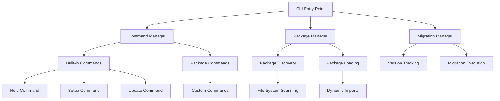
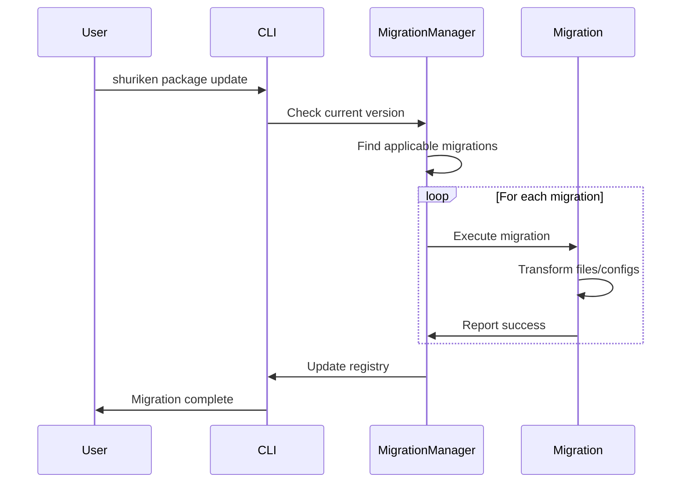

# 🎯 Core Concepts

Understanding these core concepts will help you master Shuriken CLI and build powerful, maintainable CLI tools.

## Architecture Overview

Shuriken CLI follows a modular architecture with clear separation of concerns:



## Core Components

### 1. Package Manager

The Package Manager is responsible for:

- **Discovery**: Scanning the `packages/` directory
- **Loading**: Dynamically importing package definitions
- **Validation**: Ensuring packages follow the correct structure
- **Registry**: Maintaining a registry of installed packages

```typescript
interface IPackageDefinition {
  metadata: {
    name: string;
    version: string;
    description: string;
  };
  commands: ICommandDefinition[];
  migrations?: IMigrationDefinition[];
}
```

### 2. Command Manager

The Command Manager handles:

- **Registration**: Adding commands to the CLI
- **Execution**: Running commands with proper context
- **Validation**: Checking command options and arguments
- **Error Handling**: Graceful error management

```typescript
interface ICommandDefinition {
  name: string;
  description: string;
  options?: ICommandOption[];
  arguments?: ICommandArgument[];
  execute: (options: any, context: IProjectContext) => Promise<void>;
}
```

### 3. Migration Manager

The Migration Manager provides:

- **Version Tracking**: Keeping track of installed package versions
- **Migration Execution**: Running migrations in correct order
- **Rollback Support**: Ability to rollback migrations
- **State Management**: Maintaining migration state

```typescript
interface IMigrationDefinition {
  version: string;
  description: string;
  execute: (context: IProjectContext) => Promise<void>;
  rollback?: (context: IProjectContext) => Promise<void>;
}
```

## Key Concepts

### Packages

A **package** in Shuriken CLI is a self-contained module that provides:

- Commands for specific functionality
- Setup and configuration logic
- Migration scripts for version updates
- Shared utilities and templates

#### Package Structure

```
packages/my-package/
├── commands/           # Command implementations
│   ├── setup.ts
│   ├── build.ts
│   └── deploy.ts
├── migrations/         # Version migration scripts
│   ├── 1.0.0.ts
│   ├── 1.1.0.ts
│   └── index.ts
├── templates/          # Code templates
│   ├── component.ts
│   └── service.ts
├── core/              # Shared utilities
│   ├── logger.ts
│   ├── file.ts
│   └── process.ts
└── index.ts           # Package definition
```

### Commands

**Commands** are the building blocks of functionality:

- Each command performs a specific task
- Commands can have options and arguments
- Commands receive project context
- Commands can be interactive or non-interactive

#### Command Types

1. **Setup Commands**: Initialize package configuration
2. **Update Commands**: Apply migrations and updates
3. **Generator Commands**: Create new files/structures
4. **Utility Commands**: Perform specific tasks
5. **Interactive Commands**: Prompt users for input

### Migrations

**Migrations** handle version upgrades:

- Named by target version (e.g., `1.2.0.ts`)
- Executed in semantic version order
- Can modify files, update configs, or transform code
- Support rollback functionality

#### Migration Lifecycle



### Project Context

The **Project Context** provides commands with information about:

- Current working directory
- Project type (React, Vue, Node.js, etc.)
- Existing configuration files
- Package registry state
- Environment variables

```typescript
interface IProjectContext {
  workingDirectory: string;
  projectType: string;
  packageManager: 'npm' | 'yarn' | 'pnpm';
  configFiles: string[];
  registryData: any;
  environment: Record<string, string>;
}
```

## Dependency Injection

Shuriken CLI uses **Inversify** for dependency injection:

### Container Configuration

```typescript
// Core container setup
const container = new Container();
container.bind<Logger>(TYPES.Logger).to(Logger).inSingletonScope();
container.bind<FileService>(TYPES.FileService).to(FileService);
container.bind<PackageManager>(TYPES.PackageManager).to(PackageManager);
```

### Using Injected Dependencies

```typescript
@injectable()
export class MyCommand {
  constructor(
    @inject(TYPES.Logger) private logger: Logger,
    @inject(TYPES.FileService) private fileService: FileService
  ) {}

  async execute(options: any, context: IProjectContext): Promise<void> {
    this.logger.info('Executing command...');
    // Command logic here
  }
}
```

## Lazy Loading

Shuriken CLI implements **lazy loading** for performance:

### Package Discovery

1. **Scan Phase**: Find all package directories
2. **Metadata Phase**: Load only package metadata
3. **Command Phase**: Load commands only when needed

### Benefits

- ⚡ **Fast Startup**: Only load what's needed
- 💾 **Memory Efficient**: Minimal memory footprint
- 🔄 **Scalable**: Performance doesn't degrade with more packages

## Configuration System

### Global Configuration

Located at `~/.shuriken/config.json`:

```json
{
  "packagesPath": "./packages",
  "logLevel": "info",
  "theme": "dark"
}
```

### Package Registry

Located at `~/.shuriken/registry.json`:

```json
{
  "packages": {
    "ui-kit": {
      "version": "1.2.0",
      "installedAt": "2024-01-15T10:30:00Z",
      "config": {
        "theme": "material",
        "framework": "react"
      }
    }
  }
}
```

### Project Configuration

Located at `.shuriken.json` in project root:

```json
{
  "packages": {
    "ui-kit": "1.2.0",
    "jarvis": "2.1.0"
  },
  "config": {
    "projectType": "react",
    "buildTool": "vite"
  }
}
```

## Error Handling

Shuriken CLI implements comprehensive error handling:

### Error Types

1. **Validation Errors**: Invalid options or arguments
2. **File System Errors**: Permission or path issues
3. **Network Errors**: Remote service failures
4. **Migration Errors**: Failed migration execution
5. **Plugin Errors**: Package-specific failures

### Error Recovery

```typescript
export class RobustCommand {
  async execute(options: any, context: IProjectContext): Promise<void> {
    try {
      await this.performOperation();
    } catch (error) {
      if (error instanceof ValidationError) {
        this.logger.error(`❌ ${error.message}`);
        this.showSuggestions(error.suggestions);
      } else if (error.code === 'ENOENT') {
        this.logger.error('❌ File not found');
        this.suggestFileCreation();
      } else {
        throw error; // Re-throw unexpected errors
      }
    }
  }
}
```

## Logging System

### Logger Features

- **Levels**: debug, info, warn, error, fatal
- **Colors**: Customizable color schemes
- **Prefixes**: Fun ninja-themed prefixes
- **Timestamps**: ISO-formatted timestamps
- **Context**: Structured logging with context

### Usage Examples

```typescript
const logger = new Logger();

logger.info('🚀 Starting deployment...');
logger.success('✅ Build completed successfully');
logger.warn('⚠️ Deprecated API usage detected');
logger.error('❌ Failed to connect to service');
logger.debug('🔍 Processing file: component.tsx');
```

## Next Steps

Now that you understand the core concepts:

1. 🏗️ **[Create Your First Package](./creating-packages)** - Put theory into practice
2. ⚡ **[Learn Command Definitions](./commands)** - Build powerful commands
3. 🔄 **[Master Migrations](./migrations)** - Handle version upgrades
4. 💡 **[Explore Examples](./commands)** - See real-world implementations

---

Ready to build your first package? Let's get started! 🥷
